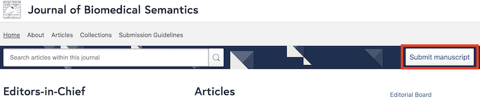
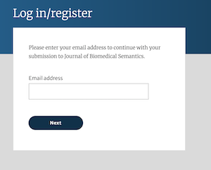
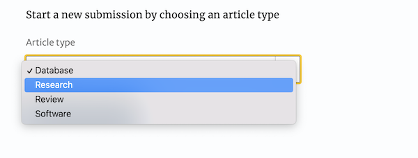
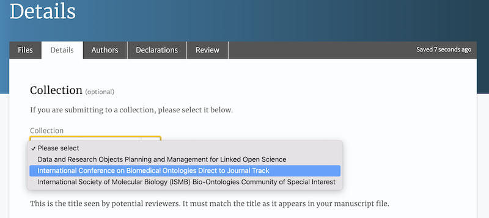

# Journal of Biomedical Semantics ICBO Thematic Series

In partnership with the [Journal of Biomedical Semantics](https://jbiomedsem.biomedcentral.com/), papers submitted to the ICBO thematic series at the Journal of Biomedical Semantics will be published immediately after acceptance and presented in the main ICBO conference following acceptance. For this track, we suggest submission by **May 1st**, at the latest, for full consideration for ICBO 2022. Articles should be submitted directly to the Journal of Biomedical Semantics following the journal [submission guidelines](https://jbiomedsem.biomedcentral.com/submission-guidelines).

## Steps to submit to the Journal of Biomedical Semantics
On the [Journal of Biomedical Semantics](https://jbiomedsem.biomedcentral.com/) home page, click the **Submit manuscript** button.

If you do not have an account, you will need to create a login.

After you have logged in, choose the type of submission you are making.

On the next page, choose the **Details** tab and select the **International Conference on Biomedical Ontologies Direct to Journal Track** collection.

Continue to process by filling in the **Title** and **Abstract** information, and uploading a **Cover letter**. Be sure the fill in the information required on the remaining tabs, and to follow the journal [submission guidelines](https://jbiomedsem.biomedcentral.com/submission-guidelines).
